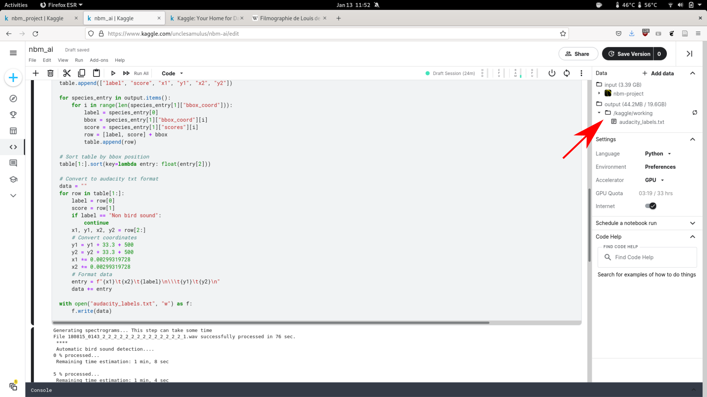

## 4. Executer le modèle; analyser un fichier son

### 4.1 Téléverser le fichier son

Munissez vous d'un fichier son au format wav. Pour le moment seules les fréquences d'échantillonage à 44100 et 48000 Hz sont acceptées. 

Passez votre souris sur nbm-project à droite de l'écran 4.1.1. 
Cliquer ensuite sur les trois points verticaux (4.1.2) puis 'Open in a new tab'. 
Une nouvelle fenêtre s'ouvre.

Descendre en bas de la fenêtre (scroller). 
Cliquer sur '+ New Version' (4.1.3).

Une pop-up s'affiche. Cliquer sur 'Upload File'. 

Choisir le fichier son que vous souhaitez analyser.

Cliquer sur 'Create'. 

### 4.2 Retourner sur le Notebook

Fermer la fenêtre dans laquelle vous êtes. 
Revenir ensuite sur celle contenant le code. 

Deux options : 
1/ Attendre le temps nécessaire pour qu'un point noir, à côté de nbm-project apparaisse. 4.2.1. 

Cliquer dessus puis cliquer sur 'update'. 

2/ En haut à droite à côté de nbm-project, cliquer sur les trois points verticaux (4.2.2.1).

Sélectionner "Check for updates" (4.2.2.2).

Normalement, celui-ci doit vous proposer de passer à une nouvelle version, (V2 si c'est votre premier enregistrement chargé puis +1 à chaque fois que vous chargez un enregistrement). Si ce n'est pas le cas, relancer l'opération jusqu'à que ce soit le cas. 

### 4.2 Executer le modèle

Remplacer le nom du fichier par défaut à traiter par le nom de votre fichier (rectangle rouge) dans la seconde cellule du NoteBook. 
Le nom doit contenir l'extension .wav . 

Cliquer sur run (flèche rouge).

ATTENTION : Des fois une erreur os.path ou de ce type apparait quand vous executez la cellule 2 disant que le chemin n'existe pas : "path does not exist". 
Le chemin est `dict_dir = '/kaggle/input/nbm-project/ia_data'`
Le remplacer par `dict_dir = '/kaggle/input/nbm-project/ia_data/ia_data'`
Dans la cellule 2. 

## 5. Analyser les résultats

Télécharger les sorties du modèle dans l'arborescence, sur la droite (flèche rouge). Si la sortie ne s'est pas affichée alors cliquer sur refresh (icône double flèche en rond à droite de output)

Le fichier 'audacity_labels.txt', peut être ouvert avec audacity.
