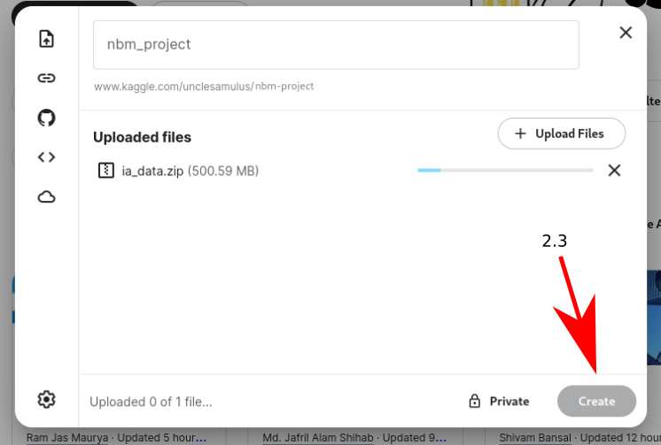
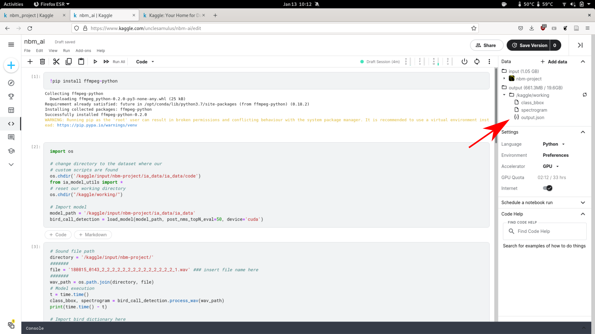

# Comment utiliser l'IA NBM sur Kaggle

## 1. Se créer un compte et se connecter sur Kaggle

Aller sur https://kaggle.com/ et se créer un compte.

Bien noter vos identifiants et mot de passe.


## 2. Téléverser l’archive ia_data.zip sur Kaggle

Télécharger l'archive ia\_data.zip disponible à l'adressse []().

Dans le menu à gauche, clicker sur dataset, puis sur le bouton ‘New dataset’.
Entrer le titre ‘nbm_project’, et uploader l’archive ia_data.zip.
Patienter jusqu’à la fin du téléchargement de l’archive, puis clicker sur ‘create’.
Enfin, clicker sur ‘Go to dataset’.




## 3. Créer un notebook et charger le modèle

Dans l'onglet nbm_project nouvellement créé, clicker sur 'New Notebook'.


Dans les cellules du NoteBook, ajouter le code suivant pour télécharger le package python nécessaire pour le traitement des fichiers audios.

```bash
!pip install ffmpeg-python
```

Puis dans une nouvelle cellule, ce morceau de code permettant de charger le modèle de l'IA.

```python
import os

# change directory to the dataset where our
# custom scripts are found
os.chdir('/kaggle/input/nbm-project/ia_data/ia_data/code')
from ia_model_utils import *
# reset our working directory
os.chdir("/kaggle/working/")

# Import model
model_path = '/kaggle/input/nbm-project/ia_data/ia_data'
bird_call_detection = load_model(model_path, post_nms_topN_eval=50, device='cuda')
```

Dans le menu à droite, clicker sur le menu déroulant 'Accelerator' et activer le GPU.

Executer les deux premières cellules de code afin de charger le modèle.


Votre environnement de travail est prêt.

Enfin, dans une dernière cellule du notebook, ajouter ce code:

```python
# Sound file path
directory = '/kaggle/input/nbm-project/'
#######
file = 'pluvier_dore.wav' ### insert file name here
#######
wav_path = os.path.join(directory, file)
# Model execution
t = time.time()
class_bbox, spectrogram = bird_call_detection.process_wav(wav_path)
print(time.time() - t)

# Import bird dictionary here
dict_dir = '/kaggle/input/nbm-project/ia_data/ia_data'
with open(os.path.join(dict_dir, 'bird_dict.json'), 'r') as f:
    birds_dict = json.load(f)

birds_dict.update({'Non bird sound': 0, 'Other': len(birds_dict) + 1})
reverse_dict = {id: bird_name for bird_name, id in birds_dict.items()}

# Maps bbox coord into a readable format
output = {reverse_dict[idx]: {key: value.cpu().numpy().tolist() for key, value in class_bbox[str(idx)].items()} for idx in range(len(reverse_dict)) if len(class_bbox[str(idx)]['bbox_coord']) > 0}

# Save class_bbox, output and spectrogram

# Convert to table
table = []
table.append(["label", "score", "x1", "y1", "x2", "y2"])

for species_entry in output.items():
    for i in range(len(species_entry[1]["bbox_coord"])):
        label = species_entry[0]
        bbox = species_entry[1]["bbox_coord"][i]
        score = species_entry[1]["scores"][i]
        row = [label, score] + bbox
        table.append(row)

# Sort table by bbox position
table[1:].sort(key=lambda entry: float(entry[2]))

# Convert to audacity txt format
data = ""
for row in table[1:]:
    label = row[0]
    score = row[1]
    if label == "Non bird sound":
        continue
    x1, y1, x2, y2 = row[2:]
    # Convert coordinates
    y1 = y1 * 33.3 + 500
    y2 = y2 * 33.3 + 500
    x1 *= 0.00299319728
    x2 *= 0.00299319728
    # Format data
    entry = f"{x1}\t{x2}\t{label}\n\\\t{y1}\t{y2}\n"
    data += entry

with open("audacity_labels.txt", "w") as f:
    f.write(data)
```

## 4. Executer le modèle; analyser un fichier son

### 4.1 Téléverser le fichier son

Munissez vous d'un fichier son au format wav.

Sur l'onglet du dataset, clicker sur les trois petits points à droite du bouton 'New Notebook', puis sur 'New version...'.

Charger votre son dans le dataset.

Retourner sur le notebook, clicker sur le point noir, et sur update pour que le dataset soit mis à jour dans votre espace de travail.

### 4.2 Executer le modèle

Modifier le nom du fichier à traiter dans la dernière cellule du NoteBook et clicker sur 'Run'.


## 5. Analyser les résultats

Télécharger les sorties du modèle dans l'arborescence, sur la droite.

Le fichier 'audacity_labels.txt', peut être ouvert avec audacity.


